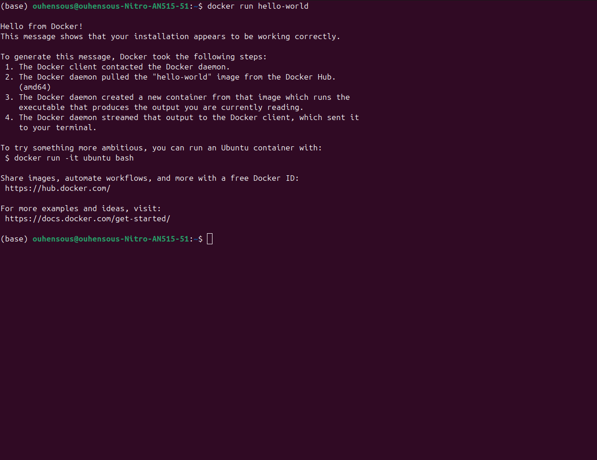
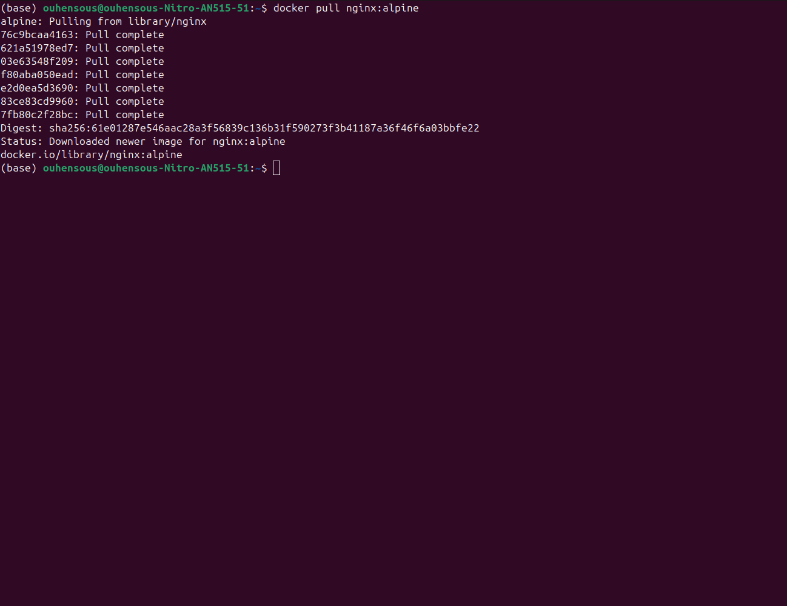
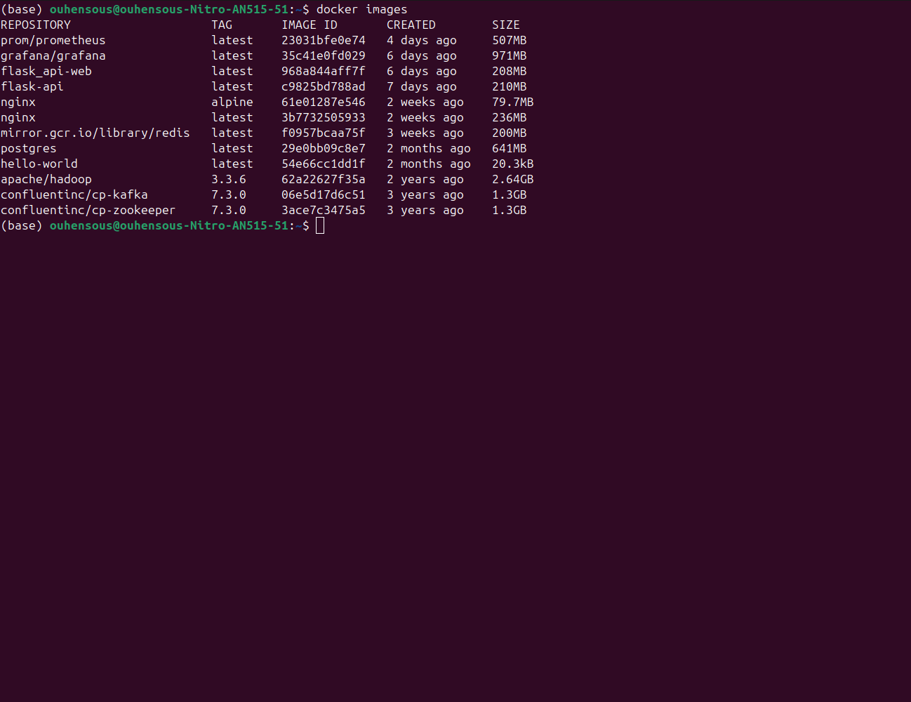
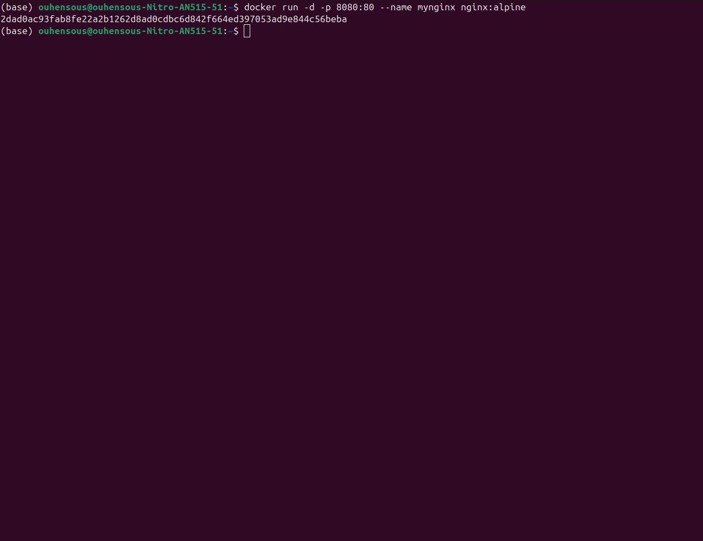
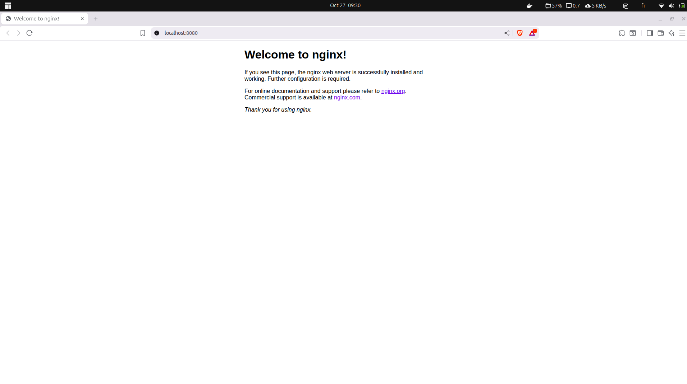
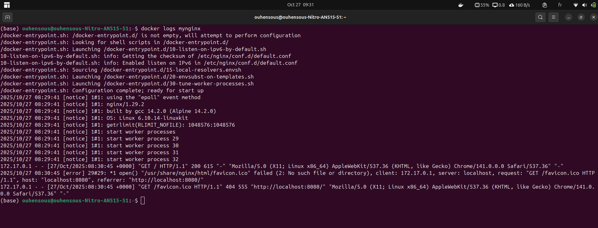
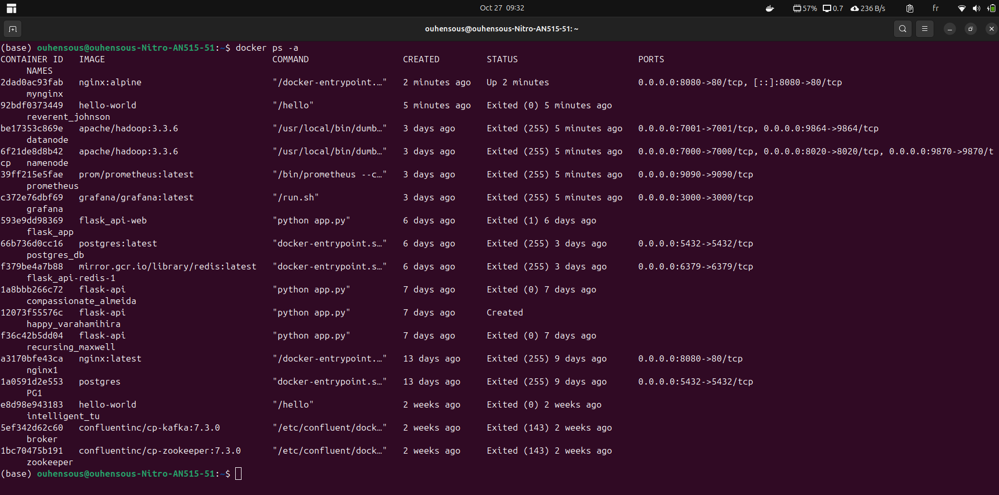
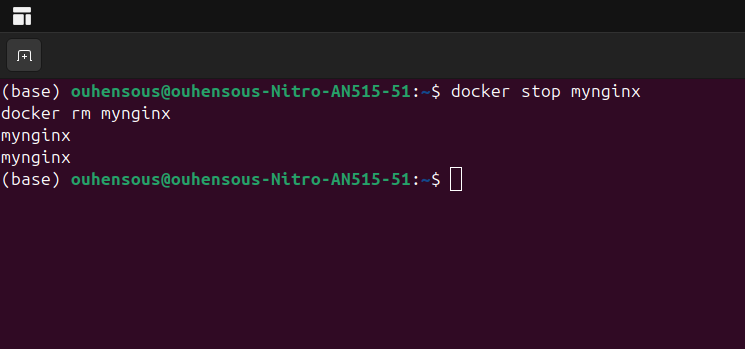
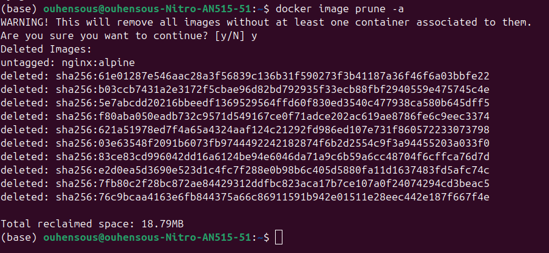

# Compte-rendu du TP DevOps/MLOps

**Auteur :** Ayoub Ouhensous  
**Date :** 27/10/2025  

---

## Table des matières
1. [Exercice 1 — Découverte de Docker](#exercice-1---découverte-de-docker)
    - [Contexte](#contexte)
    - [Étape 1 : Vérifier l’installation de Docker](#étape-1--vérifier-linstallation-de-docker)
    - [Étape 2 : Exécuter le conteneur hello-world](#étape-2--exécuter-le-conteneur-hello-world)
    - [Étape 3 : Télécharger l’image nginx:alpine sans la lancer](#étape-3--télécharger-limage-nginxalpine-sans-la-lancer)
    - [Étape 4 : Lister les images Docker](#étape-4--lister-les-images-docker)
    - [Étape 5 : Lancer un conteneur NGINX sur le port 8080](#étape-5--lancer-un-conteneur-nginx-sur-le-port-8080)
    - [Étape 6 : Vérifier l’accès au serveur web](#étape-6--vérifier-laccès-au-serveur-web)
    - [Étape 7 : Afficher les logs du conteneur](#étape-7--afficher-les-logs-du-conteneur)
    - [Étape 8 : Lister tous les conteneurs](#étape-8--lister-tous-les-conteneurs)
    - [Étape 9 : Arrêter et supprimer le conteneur NGINX](#étape-9--arrêter-et-supprimer-le-conteneur-nginx)
    - [Étape 10 : Nettoyer les images inutilisées](#étape-10--nettoyer-les-images-inutilisées)
- [Questions de réflexion](#questions-de-réflexion)

---

## Exercice 1 — Découverte de Docker

### Contexte
Première prise en main de Docker Desktop et découverte des commandes de base pour gérer les images et les conteneurs.

### Étape 1 : Vérifier l’installation de Docker
**Commandes utilisées :**
```bash
docker --version
docker info
````

**Explication :**
Ces commandes permettent de vérifier que Docker Desktop est correctement installé et que le démon Docker est en cours d’exécution.


---

### Étape 2 : Exécuter le conteneur hello-world

**Commande :**

```bash
docker run hello-world
```

**Explication :**
Cette commande télécharge l’image `hello-world` (si elle n’existe pas localement) et exécute un conteneur qui affiche un message de test.



---

### Étape 3 : Télécharger l’image nginx:alpine sans la lancer

**Commande :**

```bash
docker pull nginx:alpine
```

**Explication :**
Télécharge uniquement l’image sans créer de conteneur.



---

### Étape 4 : Lister les images Docker

**Commande :**

```bash
docker images
```

**Explication :**
Affiche toutes les images locales avec leur nom, tag, et taille.



---

### Étape 5 : Lancer un conteneur NGINX sur le port 8080

**Commande :**

```bash
docker run -d -p 8080:80 --name mynginx nginx:alpine
```

**Explication :**
Lance le conteneur en arrière-plan avec le port 8080 lié au port 80 interne.



---

### Étape 6 : Vérifier l’accès au serveur web

Accéder à l’adresse suivante depuis le navigateur :
[http://localhost:8080](http://localhost:8080)



---

### Étape 7 : Afficher les logs du conteneur

**Commande :**

```bash
docker logs mynginx
```

**Explication :**
Permet de consulter les messages de démarrage et d’exécution du serveur.



---

### Étape 8 : Lister tous les conteneurs

**Commande :**

```bash
docker ps -a
```

**Explication :**
Affiche la liste complète des conteneurs, qu’ils soient actifs ou stoppés.



---

### Étape 9 : Arrêter et supprimer le conteneur NGINX

**Commandes :**

```bash
docker stop mynginx
docker rm mynginx
```

**Explication :**
Arrête le conteneur actif puis le supprime du système.



---

### Étape 10 : Nettoyer les images inutilisées

**Commande :**

```bash
docker image prune -a
```

**Explication :**
Supprime toutes les images non utilisées afin de libérer de l’espace disque.



---

## Questions de réflexion

**1. Différence entre image et conteneur**
Une **image** est un modèle immuable contenant tout le nécessaire pour exécuter une application.
Un **conteneur** est une instance en exécution d’une image.

*Analogie : L’image est la recette, le conteneur est le plat cuisiné.*

**2. Utilité de l’option -d**
L’option `-d` (detached mode) permet d’exécuter le conteneur en arrière-plan, sans bloquer le terminal.

````

---

✅ **Instructions pour GitHub** :  

1. Dans ton projet, crée un fichier `README.md`.  
2. Copie-colle le Markdown ci-dessus dedans.  
3. Ajoute tes images dans le dossier `ex1/` (comme dans ton LaTeX).  
4. Commit et push sur ton dépôt :  
```bash
git add README.md ex1/*
git commit -m "Ajout du compte-rendu TP Docker"
git push origin main
````

---

Si tu veux, je peux te générer **directement un README.md complet prêt à mettre dans GitHub**, avec tous les liens et images structurés.

Veux‑tu que je fasse ça ?
